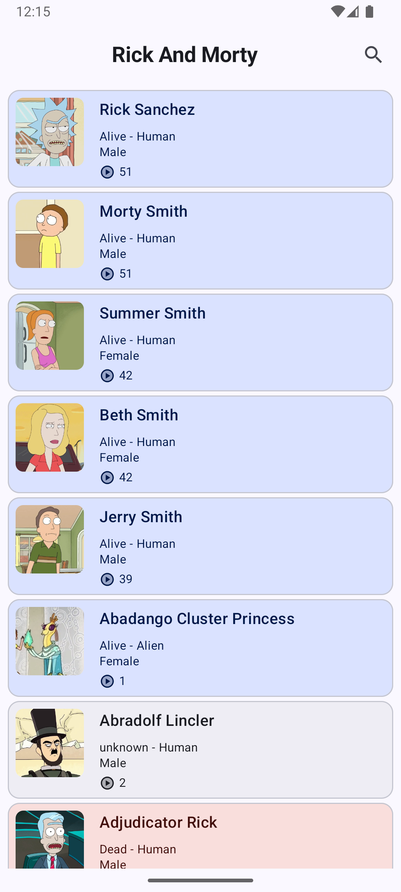
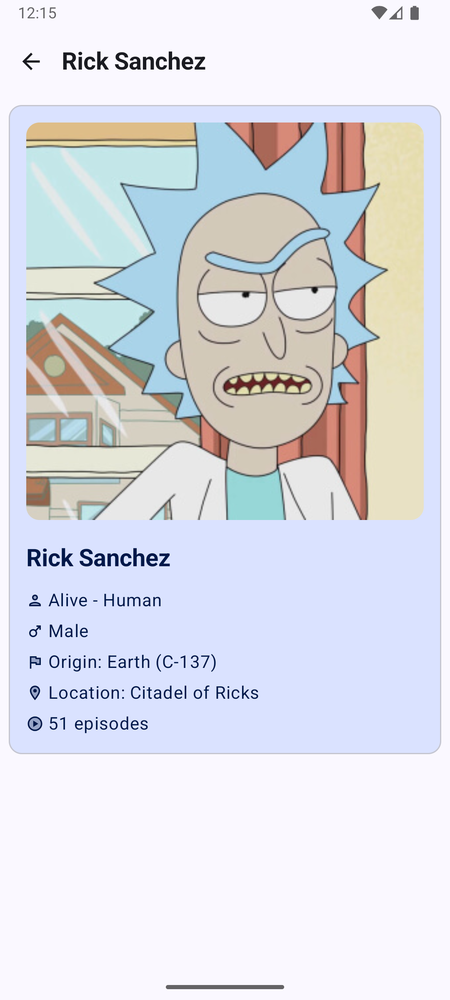
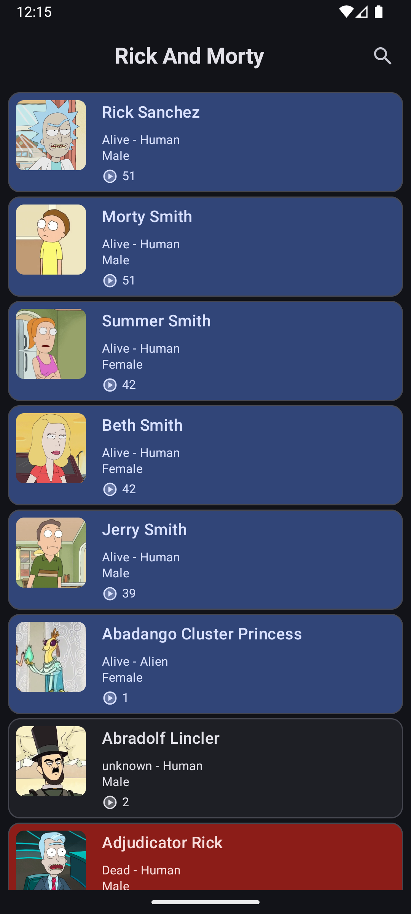
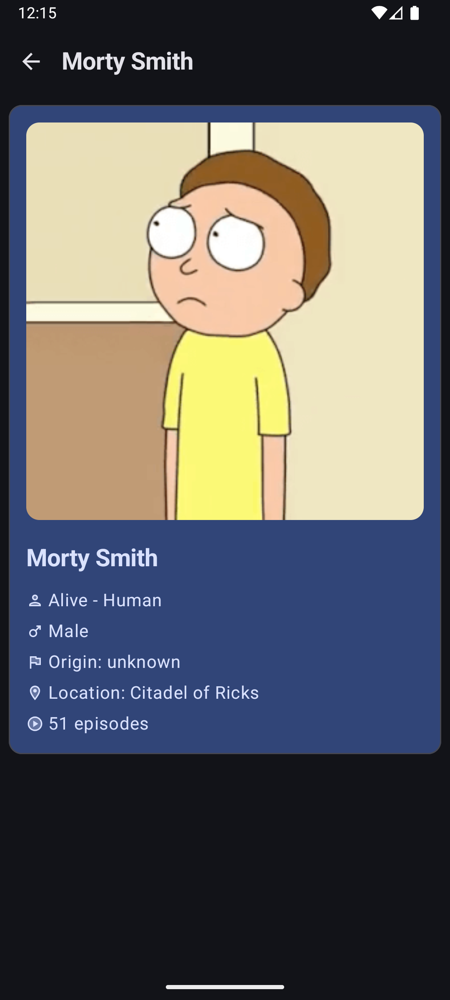

# Rick and Morty App 🛸

An Android app built with Kotlin and Jetpack Compose that consumes the [Rick and Morty API](https://rickandmortyapi.com/documentation/#character). It allows users to browse through a list of characters and view detailed information about each one.

---

## ✨ Features

- ✅ Paginated character list using **Paging 3**
- ✅ Character detail screen (status, species, gender, location, episodes, etc.)
- ✅ UI states handling: **Loading**, **Error**, and **Empty**
- ✅ Modern UI using **Jetpack Compose**
- ✅ Navigation using **Navigation Compose**
- ✅ Image loading with **Coil**
- ✅ Built with **Clean Architecture** and **MVVM**

---

## 🧱 Architecture

This project follows a Clean Architecture approach with layered separation:

- **Domain Layer**: UseCases and Entities
- **Data Layer**: API service, DTOs, mappers, remote data sources, repository implementation
- **Presentation Layer**: ViewModels, UI state management, Composables

Each layer communicates only with its adjacent layer, ensuring decoupling and testability.

---

## 🧰 Tech Stack

- **Language**: Kotlin
- **UI Toolkit**: Jetpack Compose
- **Architecture**: Clean Architecture + MVVM
- **Dependency Injection**: [Koin](https://insert-koin.io/)
- **Networking**: Retrofit + OkHttp + Gson
- **Pagination**: Paging 3
- **Image Loading**: Coil
- **State Management**: StateFlow + Compose

---

## 🚧 TODOs

- 🧪 Add unit tests for:
    - Domain layer (use cases)
    - Data layer (repositories and data sources)
    - UI layer (ViewModels and UI state)
- 📱 Add responsiveness support for tablets/foldables
- 🌙 Optional: Dark mode toggle
- 🔍 Optional: Character search suggestions

---

## 📷 Screenshots

| Characters List | Character Detail | Characters List (Dark)       | Character Detail (Dark)         |
|-----------------|------------------|---------------------------------|---------------------------------|
|  |  |  |  |

---

## 🤝 Acknowledgements

- Thanks to [Rick and Morty API](https://rickandmortyapi.com/) for providing an awesome open RESTful API.

---

## 📄 License

This project is open-source and available under the [MIT License](LICENSE).